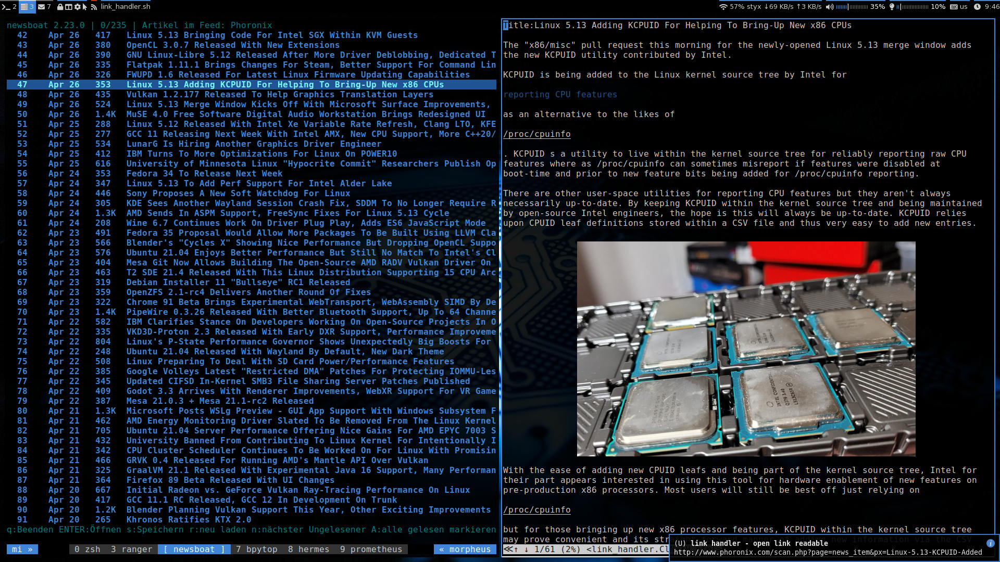
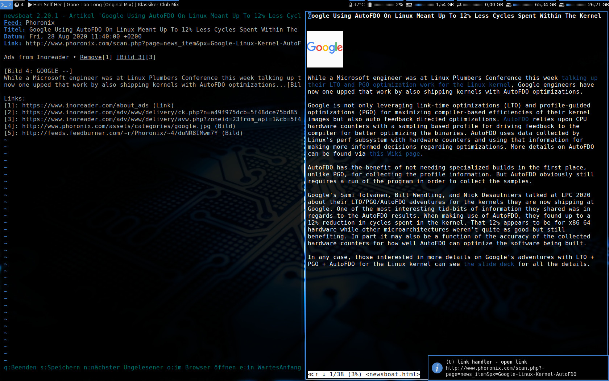

# dotfiles

I try to minimize what's directly in `$HOME`, so most configs can be found
in `$HOME/.config`. Usefull scripts in addition to this configs can be
found in my other repositories.

| config            | description                                        |
| :---------------- | :------------------------------------------------- |
| aria2             | download manager                                   |
| bash              | shell                                              |
| bpytop            | resource monitor that shows usage and stats        |
| cdw               | terminal front-end for cdrecord                    |
| cmus              | music player                                       |
| dunst             | notification daemon                                |
| highlight         | a universal sourcecode to formatted text converter |
| htop              | interactive process viewer                         |
| i3                | tiling window manager                              |
| i3status          | status line for i3bar                              |
| libinput-gestures | gestures on touchpad via libinput                  |
| mc                | visual shell for unix-like systems                 |
| mpv               | media player                                       |
| neofetch          | customizable system info script                    |
| newsboat          | rss/atom feedreader                                |
| npm               | javascript package manager                         |
| nvim              | text editor ,ide                                   |
| paru              | aur helper                                         |
| picom             | compositor                                         |
| polybar           | status bar                                         |
| qutebrowser       | web browser                                        |
| ranger            | file manager                                       |
| rofi              | application launcher and dmenu replacement         |
| sxiv              | image viewser                                      |
| systemd           | units, timers and targets                          |
| tmux              | terminal multiplexer                               |
| w3m               | text oriented browser                              |
| wget              | the non-interactive network downloader             |
| xorg              | x window system related, xressources, xmodmap      |
| youtube-dl        | youtube downloader                                 |
| zathura           | document viewer                                    |
| zsh               | shell                                              |

