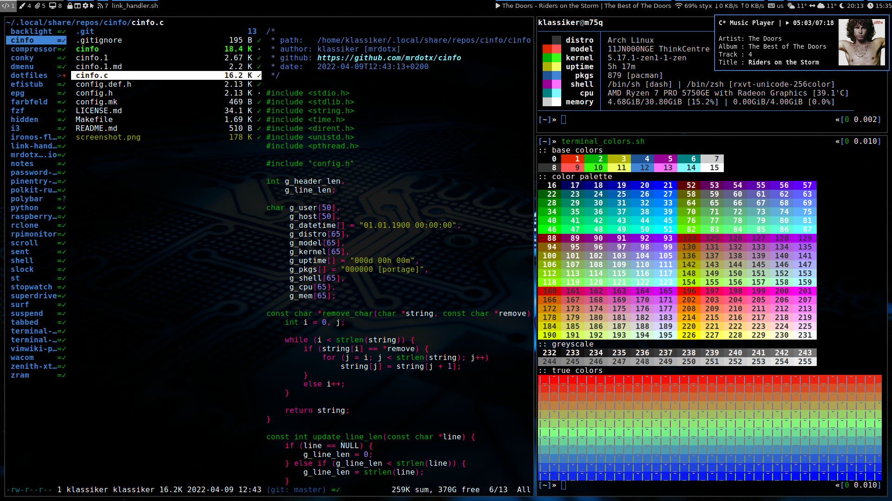
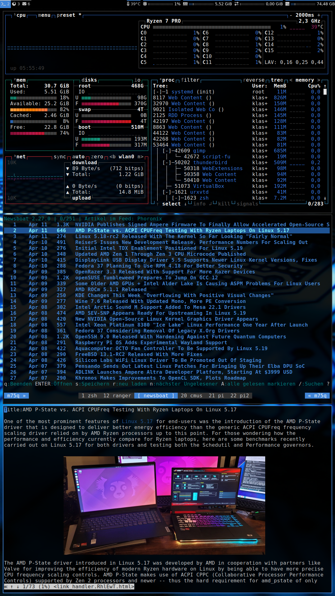

# dotfiles

| name              | comment                                    |
| :---------------- | :----------------------------------------- |
| aria2             | download manager                           |
| bash              | shell                                      |
| cmus              | music player                               |
| conky             | infotainment system monitor                |
| dunst             | notification daemon                        |
| i3                | tiling window manager                      |
| libinput-gestures | gestures on touchpad via libinput          |
| mpv               | media player                               |
| newsboat          | rss/atom feedreader                        |
| picom             | compositor                                 |
| polybar           | status bar                                 |
| qutebrowser       | web browser                                |
| ranger            | file manager                               |
| rofi              | application launcher and dmenu replacement |
| sxiv              | image viewser                              |
| tmux              | terminal multiplexer                       |
| youtube-dl        | youtube downloader                         |
| zathura           | document viewer                            |
| zsh               | shell                                      |

I try to minimize what's directly in ```$HOME```, so most configs can be found
in ```$HOME/.config```. Usefull scripts in addition to this configs can be
found in my other repositories.



