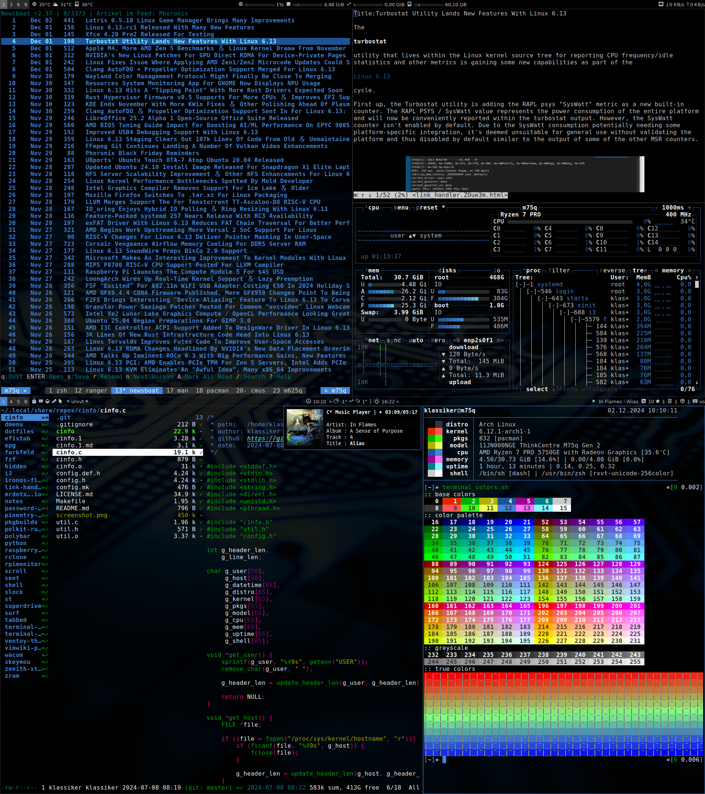

# dotfiles

I try to minimize what's directly in `$HOME`, so most configs can be found
in `$HOME/.config`. Usefull scripts in addition to this configs can be
found in my other repositories.

| config            | description                                          |
| :---------------- | :--------------------------------------------------- |
| aria2             | download manager                                     |
| bash              | shell                                                |
| btop              | resource monitor that shows usage and stats          |
| cdw               | terminal front-end for cdrecord                      |
| cmus              | music player                                         |
| dunst             | notification daemon                                  |
| fontconfig        | font configuration files                             |
| highlight         | a universal sourcecode to formatted text converter   |
| htop              | interactive process viewer                           |
| i3                | tiling window manager                                |
| i3status          | status line for i3bar                                |
| libinput-gestures | gestures on touchpad via libinput-gestures           |
| mc                | visual shell for unix-like systems                   |
| mpv               | media player                                         |
| ncdu              | ncurses disk usage                                   |
| newsboat          | rss/atom feedreader                                  |
| npm               | javascript package manager                           |
| nsxiv             | image viewer                                         |
| nvim              | text editor, ide                                     |
| pacman            | package manager utility                              |
| paru              | aur helper                                           |
| picom             | compositor                                           |
| polybar           | status bar                                           |
| qutebrowser       | web browser                                          |
| ranger            | file manager                                         |
| systemd           | units, timers and targets                            |
| tmux              | terminal multiplexer                                 |
| w3m               | text oriented browser                                |
| wget              | the non-interactive network downloader               |
| X11               | x window system related, xinit, xressources, xmodmap |
| yt-dlp            | youtube downloader                                   |
| zathura           | document viewer                                      |
| zsh               | shell                                                |

